<p align="center">
  
</p>

<p align="center">
  <a href="https://www.linkedin.com/in/arrofizeinabdillah66/">
    
  </a>
  &nbsp;
  <a href="mailto:arrofi.zein12@gmail.com">
    
  </a>
  &nbsp;
  <a href="https://github.com/h1ntz0?tab=repositories">
    
  </a>
</p>

---

### 👨‍💻 About Me

Quality Assurance & Test Automation Engineer with a strong foundation in end-to-end regression, API contract validation, and CI/CD quality pipelines. I design reliable test suites that catch defects early and ensure high software reliability across web applications and backend services.

<table>
  <tr>
    <td width="50%" valign="top">
      <b>📍 Location:</b> Indonesia<br>
      <b>💼 Role:</b> QA &amp; Test Automation Engineer<br>
      <b>🧪 Core Focus:</b> E2E Testing, API Testing, Accessibility (a11y)<br>
    </td>
    <td width="50%" valign="top">
      <b>🎯 Specialties:</b> Playwright, Pytest, Vitest, CI/CD Gates<br>
      <b>🔍 Quality Standard:</b> WCAG 2.2 AA Compliance, Strict Schema Check<br>
      <b>🌱 Currently Exploring:</b> Contract Testing (Pact) &amp; k6 Load Testing<br>
    </td>
  </tr>
</table>

---

### 🚀 Selected Work & Repositories

<table>
<tr>
<td width="50%" valign="top">

### 🧪 [api-contract-regression-tester](https://github.com/h1ntz0/api-contract-regression-tester)
**Autonomous OpenAPI Spec & Payload Regression Engine**

* Auto-parses Swagger/OpenAPI specs into positive & negative test matrices.
* Deep schema validation against type mismatches & missing required fields.
* Generates interactive HTML execution reports with full HTTP logs.

```text
Python · Pytest · Requests · OpenAPI · HTML Reports
```

</td>
<td width="50%" valign="top">

### ⚡ [Ranime Engine](https://github.com/h1ntz0/Ranime)
**Local-First Anime Discovery & Tracking Platform Backend**

* REST & GraphQL backend with strict schema validation and JWT auth.
* Comprehensive Vitest suites covering route handlers & caching.
* Containerized PostgreSQL workflow powered by Docker Compose.

```text
TypeScript · Fastify 5 · GraphQL · PostgreSQL · Docker · Vitest
```

</td>
</tr>
<tr>
<td width="50%" valign="top">

### 🤖 [telegram-sticker-bot](https://github.com/h1ntz0/telegram-sticker-bot)
**Automated Image Transformation & Sticker Asset Pipeline**

* Asynchronous photo processor with aspect-ratio padding & transparent borders.
* Persistent SQLite state machine for user conversion workflows.

```text
Python · python-telegram-bot · Pillow · SQLite
```

</td>
<td width="50%" valign="top">

### 🎯 [Digital QA Portfolio](https://github.com/h1ntz0/my-portfolio)
**Evidence-Driven QA Showcase & Automated Test Architecture**

* Playwright E2E suites verifying dynamic states & navigation flows.
* Integrated `axe-core` accessibility engine enforcing WCAG 2.2 AA.

```text
TypeScript · Playwright · Next.js 15 · Tailwind CSS · axe-core
```

</td>
</tr>
</table>

---

### 🛠️ Technical Stack & Tooling

<table>
<tr>
<td width="33%" align="center">
<strong>Testing &amp; QA Automation</strong>
<br/><br/>
<a href="https://skillicons.dev">
  
</a>
</td>
<td width="33%" align="center">
<strong>Languages &amp; Runtimes</strong>
<br/><br/>
<a href="https://skillicons.dev">
  
</a>
</td>
<td width="33%" align="center">
<strong>Infra &amp; Databases</strong>
<br/><br/>
<a href="https://skillicons.dev">
  
</a>
</td>
</tr>
</table>

---

### 📊 GitHub Activity & Statistics

<p align="center">
  
</p>

<p align="center">
  
  &nbsp;
  
</p>

<p align="center">
  
  &nbsp;
  
</p>
