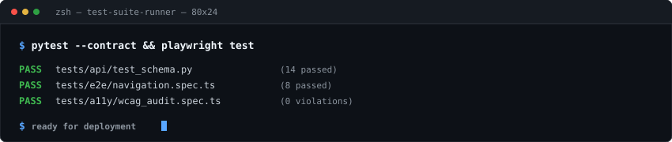
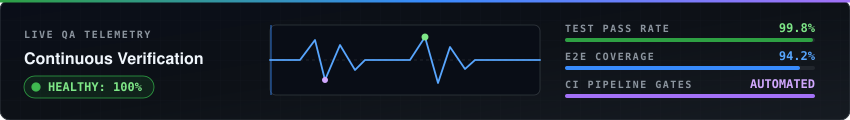
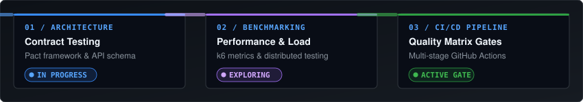

<p align="center">
  
</p>

<p align="center">
  <a href="https://github.com/h1ntz0">
    
  </a>
  &nbsp;
  <a href="https://www.linkedin.com/in/arrofizeinabdillah66/">
    
  </a>
  &nbsp;
  <a href="mailto:arrofi.zein12@gmail.com">
    
  </a>
  &nbsp;
  <a href="https://github.com/h1ntz0?tab=repositories">
    
  </a>
</p>

---

<p align="center">
  <em>QA engineer turning ambiguity into evidence — building test pipelines that fail fast, audit deeply, and ship with confidence.</em>
</p>

---

<p align="center">
  
</p>

<table>
<tr>
<td width="33%" valign="top">

#### **Test Automation**
* **Playwright** (TypeScript / E2E)
* **Pytest** (Python API Testing)
* **Vitest** (Unit & Integration)
* Cross-browser UI Test Suites

</td>
<td width="33%" valign="top">

#### **Quality & Reliability**
* API Schema & Payload Validation
* Accessibility Audit (**axe-core**)
* Static Data Modeling for Case Studies
* Evidence-Driven Test Logging

</td>
<td width="33%" valign="top">

#### **CI/CD & Infra**
* **GitHub Actions** Automation
* Multi-stage Quality Matrix Gates
* **Docker Compose** DB Environments
* Linux & Shell Scripting

</td>
</tr>
</table>

---

<p align="center">
  
</p>

<table>
<tr>
<td width="50%" valign="top">

### 01 / Digital QA Portfolio
**Evidence-driven QA platform demonstrating automated test architecture & case studies.**

```text
Playwright · TypeScript · Next.js 15 · Tailwind CSS · axe-core
```

* 🔹 Automated E2E regression suites covering navigation & state.
* 🔹 WCAG 2.2 AA automated accessibility testing.
* 🔹 Evidence-backed test logs & reproduction workflows.

[**Explore Repository →**](https://github.com/h1ntz0/my-portfolio)

</td>
<td width="50%" valign="top">

### 02 / Ranime Engine
**Local-first anime discovery and tracking backend with GraphQL & PostgreSQL.**

```text
Fastify 5 · React 19 · TypeScript · PostgreSQL · Docker · Vitest
```

* 🔹 RESTful API with strict schema validation & JWT auth.
* 🔹 Vitest test suites verifying route handlers & caching.
* 🔹 Containerized database workflow using Docker Compose.

[**Explore Repository →**](https://github.com/h1ntz0/Ranime)

</td>
</tr>
<tr>
<td colspan="2" valign="top">

### 03 / Telegram Sticker Conversion Engine
**Automated image processing bot converting user photos into compliant Telegram sticker assets.**

```text
Python · python-telegram-bot · Pillow · SQLite
```

* 🔹 Automated image resizing, aspect ratio normalization, and transparent padding pipeline.
* 🔹 Asynchronous webhook handling with persistent SQLite conversation state tracking.

[**Explore Repository →**](https://github.com/h1ntz0/telegram-sticker-bot)

</td>
</tr>
</table>

---

<p align="center">
  
</p>

<table>
<tr>
<td width="33%" align="center">
<strong>Testing &amp; QA Automation</strong>
<br/><br/>
<a href="https://skillicons.dev">
  
</a>
</td>
<td width="33%" align="center">
<strong>Languages &amp; Runtimes</strong>
<br/><br/>
<a href="https://skillicons.dev">
  
</a>
</td>
<td width="33%" align="center">
<strong>Infra &amp; Databases</strong>
<br/><br/>
<a href="https://skillicons.dev">
  
</a>
</td>
</tr>
</table>

---

<p align="center">
  
</p>

<p align="center">
  
</p>

<p align="center">
  
</p>

<p align="center">
  
  &nbsp;
  
</p>

<p align="center">
  
  &nbsp;
  
</p>

---

<p align="center">
  
</p>

<p align="center">
  
</p>

---

<p align="center">
  <a href="https://github.com/h1ntz0"></a>
  &nbsp;
  <a href="https://www.linkedin.com/in/arrofizeinabdillah66/"></a>
  &nbsp;
  <a href="mailto:arrofi.zein12@gmail.com"></a>
</p>

<p align="center">
  <sub>Always shipping. Always verifying.</sub>
</p>
